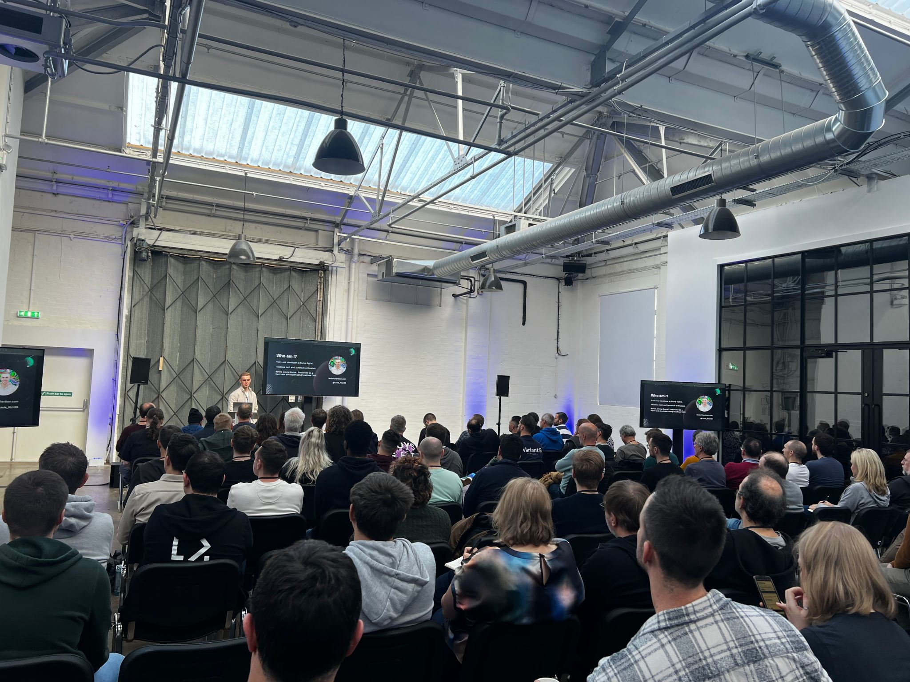
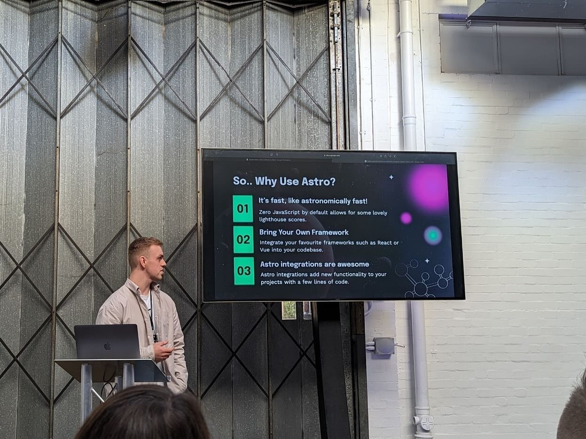
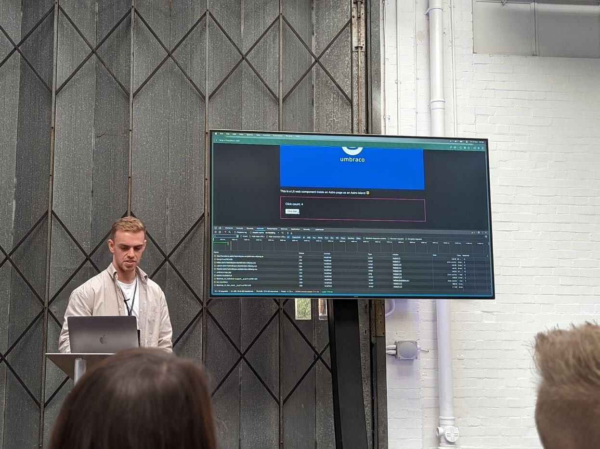

# 2023: Year In-Review

Looking back at 2023; it was a great year in terms of my career and personal development. As we progress through the year accomplishing small wins, we don't truly appreciate how much we have achieved until we sit down to reflect.

I started the year off strong and finished up a project with a client who wanted to improve their web presence for their 2D animation studio in Bristol. I was freelancing before this with other digital agencies, but this was special because it was my first client who I worked with directly.

## Landing my first full-time position

Throughout my time freelancing I always wanted to find something full-time but the freelancing gigs helped me gain that initial commercial experience working with clients. I was fortunate enough to land my first full-time position in March at [Bump Digital](https://bump.digital/); a fully remote Umbraco agency.

Prior to working at Bump I'd never heard of Umbraco as I wasn't too clued-up about C# and .NET based content management systems. I was soon introduced to the Umbraco community by attending the Umbraco Spark conference in Bristol. This was my first time attending a developer conference and it brought great insight into what is possible with Umbraco.

Fast forward to April and I got the chance to do a virtual talk at the [umBristol](https://www.umbristol.co.uk/) meet up. This talk was based on my experience and takeaways from the Umbraco Spark conference as a front-end developer. I liked the topic of this talk since it didn't feel like there was as much pressure due to it being me talk about my experience. This was a good entry point into public speaking; being virtual it didn't feel as intimidating to get started.

June was a great month as I attended Codegarden in Denmark. This was 3 days packed full of great talks, food, and partying. And there's one thing I realised and that is Umbracians really know how to have a good time. 🍻

Maybe Il get the chance to speak at Codegarden 2024? Which reminds me, I should probably start thinking of talk ideas!

I became an Umbraco Professional by completing my Umbraco Fundamentals training at the start of October and I plan to complete more Umbraco training in the first quarter of 2024 in hopes of becoming a Umbraco Master.

## Facing my fear of public speaking

October and November were both great months for working on my public speaking as I did my first in-person talk at the umBristol meet up. This talk was based on using Astro with the Umbraco Content Delivery API and I thought it went pretty well. This was a good opportunity to practice this talk as I'd be doing the same talk at the Umbraco UK Festival a month later in London!

I was super nervous about talking at the Umbraco UK Festival as it was a lot bigger than the local meet up I attended beforehand, and it felt more "serious". I didn't realise how many people I'd be speaking in-front of until 10 minutes before when I was sat in the audience watching Niels Lyngsø's talk.

As soon as I got up there to speak I was pleasantly surprised to find that the nerves just vanished and I was ready; after resolving the technical issues I was having with my browser... 😅

Here's a few pictures from my talk:

If you are ever thinking about whether to do more public speaking or even to just get started, I'd definitely recommend it! It may feel daunting at first but it can actually feel really enjoyable in the moment when the adrenaline kicks in. Surprisingly you come away from the experience wanting to do more of it.

## Christmas wrap-up

In December, we wrapped up the year with a team trip to Cologne in Germany to explore round the Christmas markets drinking mulled wine and eating great food.

I had a great end to the year by getting my article published on 24Days.in ([Astro-nomically Performant Websites using the Content Delivery API](https://24days.in/umbraco-cms/2023/sustainable-performant/astronomically-performant/)). I wanted to write an article based on the talk I did at Umbraco UK Festival in November.

## What I'm working on in 2024

In 2024 I plan on becoming an Umbraco Master as well as getting involved in more speaking gigs. I'm spending more of my free time learning C# and .NET since I've never worked with it commercially and I'd love to do so in 2024.

Thanks for reading, I hope you have a great 2024.
